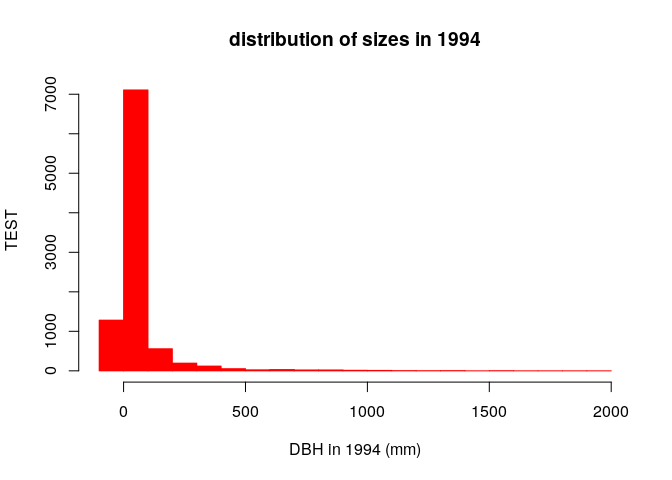
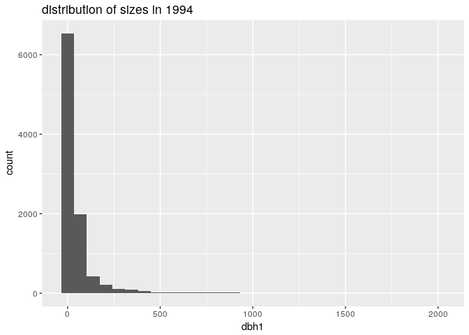

    cocoli_dat <- read.table("/home/eeb177-student/Desktop/eeb-177/lab-work/exercise-7/cocoli.txt", header = TRUE)
    head(cocoli_dat)

    ##      tag spcode   x   y dbh1 dbh2 dbh3 recr1 recr2 recr3 pom1 pom2 pom3
    ## 1 000001 PROTTE 3.0 0.9  171  267  277     A     A     A    1    2    2
    ## 2 000002 COCCPA 0.1 0.6   13   14   17     A     A     A    1    1    1
    ## 3 000003 EUGEPR 1.3 2.3   26   33   39     A     A     A    1    2    2
    ## 4 000004 PROTTE 2.2 3.4   10   17   19     A     A     A    1    1    1
    ## 5 000005 CLAVME 3.5 3.7   14   15   15     A     A     A    1    1    1
    ## 6 000006 PROTTE 4.3 4.7   12   26   25     A     A     A    1    2    2
    ##   code1 code2 code3 mult1 mult2 mult3      date1      date2      date3
    ## 1     *     *     *     1     1     1 11/02/1994 11/11/1997 11/23/1998
    ## 2     *     *     *     1     1     1 11/02/1994 11/11/1997 11/23/1998
    ## 3     M     M     M     2     2     2 11/02/1994 11/11/1997 11/23/1998
    ## 4     *     *     *     1     1     1 11/02/1994 11/11/1997 11/23/1998
    ## 5    ML    ML     M     2     2     2 11/02/1994 11/11/1997 11/23/1998
    ## 6     *     *     M     1     1     2 11/02/1994 11/11/1997 11/23/1998

    str(cocoli_dat)

    ## 'data.frame':    9466 obs. of  22 variables:
    ##  $ tag   : Factor w/ 9466 levels "-47493","000001",..: 2 3 4 5 6 7 8 9 10 11 ...
    ##  $ spcode: Factor w/ 177 levels "*","ACACME","ACALDI",..: 131 49 67 131 48 131 129 154 139 49 ...
    ##  $ x     : num  3 0.1 1.3 2.2 3.5 4.3 3.7 4.1 1.5 0.9 ...
    ##  $ y     : num  0.9 0.6 2.3 3.4 3.7 4.7 7 6.3 11 14 ...
    ##  $ dbh1  : int  171 13 26 10 14 12 15 78 29 28 ...
    ##  $ dbh2  : int  267 14 33 17 15 26 19 78 30 29 ...
    ##  $ dbh3  : int  277 17 39 19 15 25 19 78 29 33 ...
    ##  $ recr1 : Factor w/ 3 levels "*","A","P": 2 2 2 2 2 2 2 2 2 2 ...
    ##  $ recr2 : Factor w/ 5 levels "*","A","B","D",..: 2 2 2 2 2 2 2 2 2 2 ...
    ##  $ recr3 : Factor w/ 4 levels "*","A","B","D": 2 2 2 2 2 2 2 2 2 2 ...
    ##  $ pom1  : int  1 1 1 1 1 1 1 1 1 1 ...
    ##  $ pom2  : int  2 1 2 1 1 2 1 1 1 1 ...
    ##  $ pom3  : int  2 1 2 1 1 2 1 1 1 1 ...
    ##  $ code1 : Factor w/ 8 levels "*","B","L","M",..: 1 1 4 1 5 1 4 5 4 1 ...
    ##  $ code2 : Factor w/ 25 levels "*","B","BL","BQ",..: 1 1 14 1 15 1 14 15 14 1 ...
    ##  $ code3 : Factor w/ 19 levels "*","B","BM","D",..: 1 1 13 1 13 13 13 13 13 1 ...
    ##  $ mult1 : int  1 1 2 1 2 1 2 2 2 1 ...
    ##  $ mult2 : int  1 1 2 1 2 1 2 2 2 1 ...
    ##  $ mult3 : int  1 1 2 1 2 2 2 2 2 1 ...
    ##  $ date1 : Factor w/ 23 levels "11/02/1994","11/04/1994",..: 1 1 1 1 1 1 1 1 1 1 ...
    ##  $ date2 : Factor w/ 18 levels "11/10/1997","11/11/1997",..: 2 2 2 2 2 2 2 2 2 2 ...
    ##  $ date3 : Factor w/ 30 levels "11/04/1998","11/23/1998",..: 2 2 2 2 2 2 2 2 2 2 ...

    View(cocoli_dat)

    sizes_in_1994 <- cocoli_dat$dbh1
    names(sizes_in_1994) <- cocoli_dat$tag
    sizes_in_1994

    ## 000001 000002 000003 000004 000005 000006 000007 000008 000009 000010 
    ##    171     13     26     10     14     12     15     78     29     28 
    ## 000011 000012 000013 000014 000015 000016 000017 000018 000019 000020 
    ##     69     11     33    316     15     54     14     11     21     12 
    ## 000021 000022 000023 000024 000025 000026 000027 000028 000029 000030 
    ##     26     13     10     49     68     73     14     73     15     12 
    ## 000031 000032 000033 000034 000035 000036 000037 000038 000039 000040 
    ##    201     27     41     15     58     10     15     19    485     11 
    ## 000041 000042 000043 000044 000045 000046 000047 000048 000049 000050 
    ##     18    115     31     14     38     95     12     28     24    352 
    ## 000051 000052 000053 000054 000055 000056 000057 000058 000059 000060 
    ##     34     13     21     28     12     15     31     41     18     17 
    ## 000061 000062 000063 000064 000065 000066 000067 000068 000069 000070 
    ##     19     18     13     15     13    241     25     12     21     30 
    ## 000071 000072 000073 000074 000075 000076 000077 000078 000079 000080 
    ##     16     23     20   1332     56     62     27     14     15     16 
    ## 000081 000082 000083 000084 000085 000086 000087 000088 000089 000090 
    ##     19     49     21     15     21     22     26     28     38     28 
    ## 000091 000092 000093 000094 000095 000096 000097 000098 000099 000100 
    ##     74     22     12     11     32     15     20   1500     62     17 
    ## 000101 000102 000103 000104 000105 000106 000107 000108 000109 000110 
    ##     68     24     12     27     13     25     16     22     13     39 
    ## 000111 000112 000113 000114 000115 000116 000117 000118 000119 000120 
    ##     28    139     15     68     36     25     11    128     22     66 
    ## 000121 000122 000123 000124 000125 000126 000127 000128 000129 000130 
    ##     22     12     23    108     20     18     23     12     10    105 
    ## 000131 000132 000133 000134 000135 000136 000137 000138 000139 000140 
    ##     23   1363    181     91    301     52     51    112    126     34 
    ## 000141 000142 000143 000144 000145 000146 000147 000148 000149 000150 
    ##     65     11    129     13     44     29     14     22     12     10 
    ## 000151 000152 000153 000154 000155 000156 000157 000158 000159 000161 
    ##     34     35     57     21     75     15    110     13     50     11 
    ## 000162 000163 000164 000166 000167 000168 000169 000170 000171 000172 
    ##     25     31     10    212     11     33     45     39     58     20 
    ## 000173 000174 000175 000176 000177 000178 000179 000180 000181 000182 
    ##     62     -2     19     62     83     24    320     37     17    143 
    ## 000183 000184 000185 000186 000187 000188 000189 000190 000191 000192 
    ##    129     59     23     11     13     25     31     11     68     11 
    ## 000193 000194 000195 000196 000197 000198 000199 000200 000201 000202 
    ##     28     16     65     91     11     19     38     99     71     13 
    ## 000203 000204 000205 000206 000207 000208 000209 000210 000211 000212 
    ##     26     12     34     14     13     13    331     13     62     15 
    ## 000213 000214 000215 000216 000217 000218 000219 000220 000221 000222 
    ##    344     99     21     15     14     61    910     14     -2     14 
    ## 000223 000224 000225 000226 000227 000228 000229 000230 000231 000232 
    ##    168     24     20     11     63     29     40     37     18     29 
    ## 000233 000234 000235 000236 000237 000238 000239 000240 000241 000242 
    ##     91     32     30     41     17     16     14     33     65     23 
    ## 000243 000244 000245 000246 000247 000248 000249 000250 000251 000252 
    ##    182     37     25     11     25     16     28     30     13     18 
    ## 000253 000254 000255 000256 000257 000258 000259 000260 000261 000262 
    ##     37     39     14     42    125     27     11     34     11     37 
    ## 000263 000264 000265 000266 000267 000268 000269 000270 000271 000272 
    ##     13     24    205     19     18     23    360     26     20     18 
    ## 000273 000274 000275 000276 000277 000278 000279 000280 000281 000282 
    ##     19     40     25     28     17     24     55     16     10     24 
    ## 000283 000284 000285 000286 000287 000288 000289 000290 000291 000292 
    ##     15     10     32     11     10     28     11     47     16     29 
    ## 000293 000294 000295 000296 000297 000298 000299 000300 000301 000302 
    ##     22     14     13     12     24     25     18     57     14     59 
    ## 000303 000304 000305 000306 000307 000308 000309 000310 000311 000312 
    ##     13     14     25    267     38     17     15     33     11     14 
    ## 000313 000314 000315 000316 000317 000318 000319 000320 000321 000322 
    ##     14     19     25     13     11     27     22     12     18     32 
    ## 000323 000324 000325 000326 000327 000328 000329 000330 000331 000332 
    ##    261     14     13    134    114     21     17     23     22     29 
    ## 000333 000334 000335 000336 000337 000338 000339 000340 000341 000342 
    ##     15     12     27     35     24     22     17     23     17     12 
    ## 000343 000344 000345 000346 000347 000348 000349 000350 000351 000352 
    ##     21    109     12     10     12     32     15     17    250     23 
    ## 000353 000354 000355 000356 000357 000358 000359 000360 000361 000362 
    ##     17     23     39     20     29     16     60     16     12     50 
    ## 000363 000364 000365 000366 000367 000368 000369 000370 000371 000372 
    ##     35     11     14     15     12     14     43     23     40     20 
    ## 000373 000374 000375 000376 000377 000378 000379 000380 000381 000382 
    ##    204     22    132     40     38     18     17     57     75     14 
    ## 000383 000384 000385 000386 000387 000388 000389 000390 000391 000392 
    ##     14     15     29     50     56     16     15     70     43     11 
    ## 000393 000394 000395 000396 000397 000398 000399 000400 000401 000402 
    ##     51     89     64     22     13     23     29     24    146     16 
    ## 000403 000404 000405 000406 000407 000408 000409 000410 000411 000412 
    ##     13     53     41     33     21     14     42     18     21     18 
    ## 000413 000414 000415 000416 000417 000418 000419 000420 000421 000422 
    ##     20     11     32     40     24     13     10     31     27     15 
    ## 000423 000424 000425 000426 000427 000428 000429 000430 000431 000432 
    ##     15     16     24     15     17     25     13     13     64     26 
    ## 000433 000434 000435 000436 000437 000438 000439 000440 000441 000442 
    ##     18     14     67     33     29     51     11    277     30     10 
    ## 000443 000444 000445 000446 000447 000448 000449 000450 000451 000452 
    ##     13     13     14     19     14    144     74     31     20    213 
    ## 000453 000454 000455 000456 000457 000458 000459 000460 000461 000462 
    ##     10     17     15     11    699     22    111     11     13     29 
    ## 000463 000464 000465 000466 000467 000468 000469 000470 000471 000472 
    ##     38     11     10     14     17    264     45     10     10     13 
    ## 000473 000474 000475 000476 000477 000478 000479 000480 000481 000482 
    ##     11     24     14     11     28     23     18     95     26     25 
    ## 000483 000484 000485 000486 000487 000488 000489 000490 000491 000492 
    ##     29     26    790     14     18     15     27     36     12     11 
    ## 000493 000494 000495 000496 000497 000498 000499 000500 000501 000502 
    ##     13     24     13     18     11     30     24     23     25     35 
    ## 000503 000504 000505 000506 000507 000508 000509 000510 000511 000512 
    ##     17     26     16     14     35     14     66     18     38     42 
    ## 000513 000514 000515 000516 000517 000518 000519 000520 000521 000522 
    ##     21     11     15     58     18     24     58     16     14     31 
    ## 000523 000524 000525 000526 000527 000528 000529 000530 000531 000532 
    ##     17     16     19    193     18    105     88     27     27     12 
    ## 000533 000534 000535 000536 000537 000538 000539 000540 000541 000542 
    ##     36     25     35     12     21     24    118     12     27     13 
    ## 000543 000544 000545 000546 000547 000548 000549 000550 000551 000552 
    ##     24     23     31     13     13     16     36     14     32     28 
    ## 000553 000554 000555 000556 000557 000558 000559 000560 000561 000562 
    ##     18     35     17     32    216     12     26     10     32    118 
    ## 000563 000564 000565 000566 000567 000568 000569 000570 000571 000572 
    ##     82     13     51    236     14     49     34     54     43     12 
    ## 000573 000574 000575 000576 000577 000578 000579 000580 000581 000582 
    ##    425     44    249     50     28     14     13     10     20     10 
    ## 000583 000584 000585 000586 000587 000588 000589 000590 000591 000592 
    ##     10     27     12     20     11     24     15     23     69     58 
    ## 000593 000594 000595 000596 000597 000598 000599 000600 000601 000602 
    ##     18     30     22     12     16     12     25     19     10    201 
    ## 000603 000604 000605 000606 000607 000608 000609 000610 000611 000612 
    ##    360     36    141     15     20    122     25     11     31     67 
    ## 000613 000614 000615 000616 000617 000618 000619 000620 000621 000622 
    ##     59     14     20     12     90     48     23    281     75     35 
    ## 000623 000624 000625 000626 000627 000628 000629 000630 000631 000632 
    ##     11     53     30     11     33     33     24     11     14     57 
    ## 000633 000634 000635 000636 000637 000638 000639 000640 000641 000642 
    ##     19     13     17     13     19     27     11     15     11     12 
    ## 000643 000644 000645 000646 000647 000648 000649 000650 000651 000652 
    ##    167     22     53     16     37     19     28     24     25     19 
    ## 000653 000654 000655 000656 000657 000658 000659 000660 000661 000662 
    ##     23     51     11     11     13     18    173     55     61     48 
    ## 000663 000664 000665 000666 000667 000668 000669 000670 000671 000672 
    ##     22     25     40     23     15     12    188    148    350     13 
    ## 000673 000674 000675 000676 000677 000678 000679 000680 000681 000682 
    ##     13     34     12     44     31     27     30     10     33    231 
    ## 000683 000684 000685 000686 000687 000688 000689 000690 000691 000692 
    ##     42     53     51     23     13     17     10     12     51     36 
    ## 000693 000694 000695 000696 000697 000698 000699 000700 000701 000702 
    ##     14     24    276     11     20     15     15     14    152     17 
    ## 000703 000704 000705 000706 000707 000708 000709 000710 000711 000712 
    ##     13     15     13     11     18     63     13     12     35     10 
    ## 000713 000714 000715 000716 000717 000718 000719 000720 000721 000722 
    ##     18     32     10     19     11     14     14     15     16     21 
    ## 000723 000724 000725 000726 000727 000728 000729 000730 000731 000732 
    ##     79     35     15    585     13     75     43     15     10     12 
    ## 000733 000734 000735 000736 000737 000738 000739 000740 000741 000742 
    ##     25     27     29     15     28     28     19     31     24     66 
    ## 000743 000744 000745 000746 000747 000748 000749 000750 000751 000752 
    ##     13     18     39     19     21     73     91    816     18     10 
    ## 000753 000754 000755 000756 000757 000758 000759 000760 000761 000762 
    ##     20     11    115    101     36     30    198     10     25     19 
    ## 000763 000764 000765 000766 000767 000768 000769 000770 000771 000772 
    ##     27     21     32     18     44     21     37     25    130     12 
    ## 000773 000774 000775 000776 000777 000778 000779 000780 000781 000782 
    ##     36     22     34    682     78    108     19     47     16     20 
    ## 000783 000784 000785 000786 000787 000788 000789 000790 000791 000792 
    ##     16     17     53     64     15    336    159    913     41     13 
    ## 000793 000794 000795 000796 000797 000798 000799 000800 000801 000802 
    ##     24     31     25     19     11     35     36     16     19     15 
    ## 000803 000804 000805 000806 000807 000808 000809 000810 000811 000812 
    ##     13     90     36     27     54     30    132     29    324     47 
    ## 000813 000814 000815 000816 000817 000818 000819 000820 000821 000822 
    ##     57     24    415     32   1130     20     34     12     27     24 
    ## 000823 000824 000825 000826 000827 000828 000829 000830 000831 000832 
    ##     28     12     62     14     79     12    301    133     24     12 
    ## 000833 000834 000835 000836 000837 000838 000839 000840 000841 000842 
    ##     67     49     19    192     12     86     81     15     36     27 
    ## 000843 000844 000845 000846 000847 000848 000849 000850 000851 000852 
    ##     31     19     30     15     25     71     10     10     24     13 
    ## 000853 000854 000855 000856 000857 000858 000859 000860 000861 000862 
    ##     29     15     11     14    690     11     12     13     13     10 
    ## 000863 000864 000865 000866 000867 000868 000869 000870 000871 000872 
    ##     19     13     12     43    118    858     12    108    167     29 
    ## 000873 000874 000875 000876 000877 000878 000879 000880 000881 000882 
    ##    127     11     14     54     22     43     56     17     73     28 
    ## 000883 000884 000885 000886 000887 000888 000889 000890 000891 000892 
    ##     47    129     45     10     40     45     18     72     63     52 
    ## 000893 000894 000895 000896 000897 000898 000899 000900 000901 000902 
    ##     13     25    398     11     10    118     13     22     40     10 
    ## 000903 000904 000905 000906 000907 000908 000909 000910 000911 000912 
    ##     30     17     24     18     26     10     31     43     40     19 
    ## 000913 000914 000915 000916 000917 000918 000919 000920 000921 000922 
    ##     70     25     12     23     20     24     12    109     45     49 
    ## 000923 000924 000925 000926 000927 000928 000929 000930 000931 000932 
    ##    582    123     18     16    329     52     89     40     20     16 
    ## 000933 000934 000935 000936 000937 000938 000939 000940 000941 000942 
    ##     15     19     17     16     25     22     19     21    175     15 
    ## 000943 000944 000945 000946 000947 000948 000949 000950 000951 000952 
    ##    977     43     33     10     10     24    653     66     23     19 
    ## 000953 000954 000955 000956 000957 000958 000959 000960 000961 000962 
    ##     57     17     15     26     75    148     25     12     20     14 
    ## 000963 000964 000965 000966 000967 000968 000969 000970 000971 000972 
    ##     11     11     16    453    134    225     35     15     28     21 
    ## 000973 000974 000975 000976 000977 000978 000979 000980 000981 000982 
    ##     28     34     15     33     14     12    100     23     11    140 
    ## 000983 000984 000985 000986 000987 000988 000989 000990 000991 000992 
    ##     29     14     50    430     39     14     46     31     25    115 
    ## 000993 000994 000995 000996 000997 000998 000999 001000 001001 001002 
    ##    863     36     15     21     14    103     21     42     26     31 
    ##  [ reached getOption("max.print") -- omitted 8466 entries ]

    sizes_in_1997 <- cocoli_dat$dbh2
    names(sizes_in_1997) <- cocoli_dat$tag

    sizes_in_1998 <- cocoli_dat$dbh3
    names(sizes_in_1998) <- cocoli_dat$tag

    sizes_in_1994 == 171

    ## 000001 000002 000003 000004 000005 000006 000007 000008 000009 000010 
    ##   TRUE  FALSE  FALSE  FALSE  FALSE  FALSE  FALSE  FALSE  FALSE  FALSE 
    ## 000011 000012 000013 000014 000015 000016 000017 000018 000019 000020 
    ##  FALSE  FALSE  FALSE  FALSE  FALSE  FALSE  FALSE  FALSE  FALSE  FALSE 
    ## 000021 000022 000023 000024 000025 000026 000027 000028 000029 000030 
    ##  FALSE  FALSE  FALSE  FALSE  FALSE  FALSE  FALSE  FALSE  FALSE  FALSE 
    ## 000031 000032 000033 000034 000035 000036 000037 000038 000039 000040 
    ##  FALSE  FALSE  FALSE  FALSE  FALSE  FALSE  FALSE  FALSE  FALSE  FALSE 
    ## 000041 000042 000043 000044 000045 000046 000047 000048 000049 000050 
    ##  FALSE  FALSE  FALSE  FALSE  FALSE  FALSE  FALSE  FALSE  FALSE  FALSE 
    ## 000051 000052 000053 000054 000055 000056 000057 000058 000059 000060 
    ##  FALSE  FALSE  FALSE  FALSE  FALSE  FALSE  FALSE  FALSE  FALSE  FALSE 
    ## 000061 000062 000063 000064 000065 000066 000067 000068 000069 000070 
    ##  FALSE  FALSE  FALSE  FALSE  FALSE  FALSE  FALSE  FALSE  FALSE  FALSE 
    ## 000071 000072 000073 000074 000075 000076 000077 000078 000079 000080 
    ##  FALSE  FALSE  FALSE  FALSE  FALSE  FALSE  FALSE  FALSE  FALSE  FALSE 
    ## 000081 000082 000083 000084 000085 000086 000087 000088 000089 000090 
    ##  FALSE  FALSE  FALSE  FALSE  FALSE  FALSE  FALSE  FALSE  FALSE  FALSE 
    ## 000091 000092 000093 000094 000095 000096 000097 000098 000099 000100 
    ##  FALSE  FALSE  FALSE  FALSE  FALSE  FALSE  FALSE  FALSE  FALSE  FALSE 
    ## 000101 000102 000103 000104 000105 000106 000107 000108 000109 000110 
    ##  FALSE  FALSE  FALSE  FALSE  FALSE  FALSE  FALSE  FALSE  FALSE  FALSE 
    ## 000111 000112 000113 000114 000115 000116 000117 000118 000119 000120 
    ##  FALSE  FALSE  FALSE  FALSE  FALSE  FALSE  FALSE  FALSE  FALSE  FALSE 
    ## 000121 000122 000123 000124 000125 000126 000127 000128 000129 000130 
    ##  FALSE  FALSE  FALSE  FALSE  FALSE  FALSE  FALSE  FALSE  FALSE  FALSE 
    ## 000131 000132 000133 000134 000135 000136 000137 000138 000139 000140 
    ##  FALSE  FALSE  FALSE  FALSE  FALSE  FALSE  FALSE  FALSE  FALSE  FALSE 
    ## 000141 000142 000143 000144 000145 000146 000147 000148 000149 000150 
    ##  FALSE  FALSE  FALSE  FALSE  FALSE  FALSE  FALSE  FALSE  FALSE  FALSE 
    ## 000151 000152 000153 000154 000155 000156 000157 000158 000159 000161 
    ##  FALSE  FALSE  FALSE  FALSE  FALSE  FALSE  FALSE  FALSE  FALSE  FALSE 
    ## 000162 000163 000164 000166 000167 000168 000169 000170 000171 000172 
    ##  FALSE  FALSE  FALSE  FALSE  FALSE  FALSE  FALSE  FALSE  FALSE  FALSE 
    ## 000173 000174 000175 000176 000177 000178 000179 000180 000181 000182 
    ##  FALSE  FALSE  FALSE  FALSE  FALSE  FALSE  FALSE  FALSE  FALSE  FALSE 
    ## 000183 000184 000185 000186 000187 000188 000189 000190 000191 000192 
    ##  FALSE  FALSE  FALSE  FALSE  FALSE  FALSE  FALSE  FALSE  FALSE  FALSE 
    ## 000193 000194 000195 000196 000197 000198 000199 000200 000201 000202 
    ##  FALSE  FALSE  FALSE  FALSE  FALSE  FALSE  FALSE  FALSE  FALSE  FALSE 
    ## 000203 000204 000205 000206 000207 000208 000209 000210 000211 000212 
    ##  FALSE  FALSE  FALSE  FALSE  FALSE  FALSE  FALSE  FALSE  FALSE  FALSE 
    ## 000213 000214 000215 000216 000217 000218 000219 000220 000221 000222 
    ##  FALSE  FALSE  FALSE  FALSE  FALSE  FALSE  FALSE  FALSE  FALSE  FALSE 
    ## 000223 000224 000225 000226 000227 000228 000229 000230 000231 000232 
    ##  FALSE  FALSE  FALSE  FALSE  FALSE  FALSE  FALSE  FALSE  FALSE  FALSE 
    ## 000233 000234 000235 000236 000237 000238 000239 000240 000241 000242 
    ##  FALSE  FALSE  FALSE  FALSE  FALSE  FALSE  FALSE  FALSE  FALSE  FALSE 
    ## 000243 000244 000245 000246 000247 000248 000249 000250 000251 000252 
    ##  FALSE  FALSE  FALSE  FALSE  FALSE  FALSE  FALSE  FALSE  FALSE  FALSE 
    ## 000253 000254 000255 000256 000257 000258 000259 000260 000261 000262 
    ##  FALSE  FALSE  FALSE  FALSE  FALSE  FALSE  FALSE  FALSE  FALSE  FALSE 
    ## 000263 000264 000265 000266 000267 000268 000269 000270 000271 000272 
    ##  FALSE  FALSE  FALSE  FALSE  FALSE  FALSE  FALSE  FALSE  FALSE  FALSE 
    ## 000273 000274 000275 000276 000277 000278 000279 000280 000281 000282 
    ##  FALSE  FALSE  FALSE  FALSE  FALSE  FALSE  FALSE  FALSE  FALSE  FALSE 
    ## 000283 000284 000285 000286 000287 000288 000289 000290 000291 000292 
    ##  FALSE  FALSE  FALSE  FALSE  FALSE  FALSE  FALSE  FALSE  FALSE  FALSE 
    ## 000293 000294 000295 000296 000297 000298 000299 000300 000301 000302 
    ##  FALSE  FALSE  FALSE  FALSE  FALSE  FALSE  FALSE  FALSE  FALSE  FALSE 
    ## 000303 000304 000305 000306 000307 000308 000309 000310 000311 000312 
    ##  FALSE  FALSE  FALSE  FALSE  FALSE  FALSE  FALSE  FALSE  FALSE  FALSE 
    ## 000313 000314 000315 000316 000317 000318 000319 000320 000321 000322 
    ##  FALSE  FALSE  FALSE  FALSE  FALSE  FALSE  FALSE  FALSE  FALSE  FALSE 
    ## 000323 000324 000325 000326 000327 000328 000329 000330 000331 000332 
    ##  FALSE  FALSE  FALSE  FALSE  FALSE  FALSE  FALSE  FALSE  FALSE  FALSE 
    ## 000333 000334 000335 000336 000337 000338 000339 000340 000341 000342 
    ##  FALSE  FALSE  FALSE  FALSE  FALSE  FALSE  FALSE  FALSE  FALSE  FALSE 
    ## 000343 000344 000345 000346 000347 000348 000349 000350 000351 000352 
    ##  FALSE  FALSE  FALSE  FALSE  FALSE  FALSE  FALSE  FALSE  FALSE  FALSE 
    ## 000353 000354 000355 000356 000357 000358 000359 000360 000361 000362 
    ##  FALSE  FALSE  FALSE  FALSE  FALSE  FALSE  FALSE  FALSE  FALSE  FALSE 
    ## 000363 000364 000365 000366 000367 000368 000369 000370 000371 000372 
    ##  FALSE  FALSE  FALSE  FALSE  FALSE  FALSE  FALSE  FALSE  FALSE  FALSE 
    ## 000373 000374 000375 000376 000377 000378 000379 000380 000381 000382 
    ##  FALSE  FALSE  FALSE  FALSE  FALSE  FALSE  FALSE  FALSE  FALSE  FALSE 
    ## 000383 000384 000385 000386 000387 000388 000389 000390 000391 000392 
    ##  FALSE  FALSE  FALSE  FALSE  FALSE  FALSE  FALSE  FALSE  FALSE  FALSE 
    ## 000393 000394 000395 000396 000397 000398 000399 000400 000401 000402 
    ##  FALSE  FALSE  FALSE  FALSE  FALSE  FALSE  FALSE  FALSE  FALSE  FALSE 
    ## 000403 000404 000405 000406 000407 000408 000409 000410 000411 000412 
    ##  FALSE  FALSE  FALSE  FALSE  FALSE  FALSE  FALSE  FALSE  FALSE  FALSE 
    ## 000413 000414 000415 000416 000417 000418 000419 000420 000421 000422 
    ##  FALSE  FALSE  FALSE  FALSE  FALSE  FALSE  FALSE  FALSE  FALSE  FALSE 
    ## 000423 000424 000425 000426 000427 000428 000429 000430 000431 000432 
    ##  FALSE  FALSE  FALSE  FALSE  FALSE  FALSE  FALSE  FALSE  FALSE  FALSE 
    ## 000433 000434 000435 000436 000437 000438 000439 000440 000441 000442 
    ##  FALSE  FALSE  FALSE  FALSE  FALSE  FALSE  FALSE  FALSE  FALSE  FALSE 
    ## 000443 000444 000445 000446 000447 000448 000449 000450 000451 000452 
    ##  FALSE  FALSE  FALSE  FALSE  FALSE  FALSE  FALSE  FALSE  FALSE  FALSE 
    ## 000453 000454 000455 000456 000457 000458 000459 000460 000461 000462 
    ##  FALSE  FALSE  FALSE  FALSE  FALSE  FALSE  FALSE  FALSE  FALSE  FALSE 
    ## 000463 000464 000465 000466 000467 000468 000469 000470 000471 000472 
    ##  FALSE  FALSE  FALSE  FALSE  FALSE  FALSE  FALSE  FALSE  FALSE  FALSE 
    ## 000473 000474 000475 000476 000477 000478 000479 000480 000481 000482 
    ##  FALSE  FALSE  FALSE  FALSE  FALSE  FALSE  FALSE  FALSE  FALSE  FALSE 
    ## 000483 000484 000485 000486 000487 000488 000489 000490 000491 000492 
    ##  FALSE  FALSE  FALSE  FALSE  FALSE  FALSE  FALSE  FALSE  FALSE  FALSE 
    ## 000493 000494 000495 000496 000497 000498 000499 000500 000501 000502 
    ##  FALSE  FALSE  FALSE  FALSE  FALSE  FALSE  FALSE  FALSE  FALSE  FALSE 
    ## 000503 000504 000505 000506 000507 000508 000509 000510 000511 000512 
    ##  FALSE  FALSE  FALSE  FALSE  FALSE  FALSE  FALSE  FALSE  FALSE  FALSE 
    ## 000513 000514 000515 000516 000517 000518 000519 000520 000521 000522 
    ##  FALSE  FALSE  FALSE  FALSE  FALSE  FALSE  FALSE  FALSE  FALSE  FALSE 
    ## 000523 000524 000525 000526 000527 000528 000529 000530 000531 000532 
    ##  FALSE  FALSE  FALSE  FALSE  FALSE  FALSE  FALSE  FALSE  FALSE  FALSE 
    ## 000533 000534 000535 000536 000537 000538 000539 000540 000541 000542 
    ##  FALSE  FALSE  FALSE  FALSE  FALSE  FALSE  FALSE  FALSE  FALSE  FALSE 
    ## 000543 000544 000545 000546 000547 000548 000549 000550 000551 000552 
    ##  FALSE  FALSE  FALSE  FALSE  FALSE  FALSE  FALSE  FALSE  FALSE  FALSE 
    ## 000553 000554 000555 000556 000557 000558 000559 000560 000561 000562 
    ##  FALSE  FALSE  FALSE  FALSE  FALSE  FALSE  FALSE  FALSE  FALSE  FALSE 
    ## 000563 000564 000565 000566 000567 000568 000569 000570 000571 000572 
    ##  FALSE  FALSE  FALSE  FALSE  FALSE  FALSE  FALSE  FALSE  FALSE  FALSE 
    ## 000573 000574 000575 000576 000577 000578 000579 000580 000581 000582 
    ##  FALSE  FALSE  FALSE  FALSE  FALSE  FALSE  FALSE  FALSE  FALSE  FALSE 
    ## 000583 000584 000585 000586 000587 000588 000589 000590 000591 000592 
    ##  FALSE  FALSE  FALSE  FALSE  FALSE  FALSE  FALSE  FALSE  FALSE  FALSE 
    ## 000593 000594 000595 000596 000597 000598 000599 000600 000601 000602 
    ##  FALSE  FALSE  FALSE  FALSE  FALSE  FALSE  FALSE  FALSE  FALSE  FALSE 
    ## 000603 000604 000605 000606 000607 000608 000609 000610 000611 000612 
    ##  FALSE  FALSE  FALSE  FALSE  FALSE  FALSE  FALSE  FALSE  FALSE  FALSE 
    ## 000613 000614 000615 000616 000617 000618 000619 000620 000621 000622 
    ##  FALSE  FALSE  FALSE  FALSE  FALSE  FALSE  FALSE  FALSE  FALSE  FALSE 
    ## 000623 000624 000625 000626 000627 000628 000629 000630 000631 000632 
    ##  FALSE  FALSE  FALSE  FALSE  FALSE  FALSE  FALSE  FALSE  FALSE  FALSE 
    ## 000633 000634 000635 000636 000637 000638 000639 000640 000641 000642 
    ##  FALSE  FALSE  FALSE  FALSE  FALSE  FALSE  FALSE  FALSE  FALSE  FALSE 
    ## 000643 000644 000645 000646 000647 000648 000649 000650 000651 000652 
    ##  FALSE  FALSE  FALSE  FALSE  FALSE  FALSE  FALSE  FALSE  FALSE  FALSE 
    ## 000653 000654 000655 000656 000657 000658 000659 000660 000661 000662 
    ##  FALSE  FALSE  FALSE  FALSE  FALSE  FALSE  FALSE  FALSE  FALSE  FALSE 
    ## 000663 000664 000665 000666 000667 000668 000669 000670 000671 000672 
    ##  FALSE  FALSE  FALSE  FALSE  FALSE  FALSE  FALSE  FALSE  FALSE  FALSE 
    ## 000673 000674 000675 000676 000677 000678 000679 000680 000681 000682 
    ##  FALSE  FALSE  FALSE  FALSE  FALSE  FALSE  FALSE  FALSE  FALSE  FALSE 
    ## 000683 000684 000685 000686 000687 000688 000689 000690 000691 000692 
    ##  FALSE  FALSE  FALSE  FALSE  FALSE  FALSE  FALSE  FALSE  FALSE  FALSE 
    ## 000693 000694 000695 000696 000697 000698 000699 000700 000701 000702 
    ##  FALSE  FALSE  FALSE  FALSE  FALSE  FALSE  FALSE  FALSE  FALSE  FALSE 
    ## 000703 000704 000705 000706 000707 000708 000709 000710 000711 000712 
    ##  FALSE  FALSE  FALSE  FALSE  FALSE  FALSE  FALSE  FALSE  FALSE  FALSE 
    ## 000713 000714 000715 000716 000717 000718 000719 000720 000721 000722 
    ##  FALSE  FALSE  FALSE  FALSE  FALSE  FALSE  FALSE  FALSE  FALSE  FALSE 
    ## 000723 000724 000725 000726 000727 000728 000729 000730 000731 000732 
    ##  FALSE  FALSE  FALSE  FALSE  FALSE  FALSE  FALSE  FALSE  FALSE  FALSE 
    ## 000733 000734 000735 000736 000737 000738 000739 000740 000741 000742 
    ##  FALSE  FALSE  FALSE  FALSE  FALSE  FALSE  FALSE  FALSE  FALSE  FALSE 
    ## 000743 000744 000745 000746 000747 000748 000749 000750 000751 000752 
    ##  FALSE  FALSE  FALSE  FALSE  FALSE  FALSE  FALSE  FALSE  FALSE  FALSE 
    ## 000753 000754 000755 000756 000757 000758 000759 000760 000761 000762 
    ##  FALSE  FALSE  FALSE  FALSE  FALSE  FALSE  FALSE  FALSE  FALSE  FALSE 
    ## 000763 000764 000765 000766 000767 000768 000769 000770 000771 000772 
    ##  FALSE  FALSE  FALSE  FALSE  FALSE  FALSE  FALSE  FALSE  FALSE  FALSE 
    ## 000773 000774 000775 000776 000777 000778 000779 000780 000781 000782 
    ##  FALSE  FALSE  FALSE  FALSE  FALSE  FALSE  FALSE  FALSE  FALSE  FALSE 
    ## 000783 000784 000785 000786 000787 000788 000789 000790 000791 000792 
    ##  FALSE  FALSE  FALSE  FALSE  FALSE  FALSE  FALSE  FALSE  FALSE  FALSE 
    ## 000793 000794 000795 000796 000797 000798 000799 000800 000801 000802 
    ##  FALSE  FALSE  FALSE  FALSE  FALSE  FALSE  FALSE  FALSE  FALSE  FALSE 
    ## 000803 000804 000805 000806 000807 000808 000809 000810 000811 000812 
    ##  FALSE  FALSE  FALSE  FALSE  FALSE  FALSE  FALSE  FALSE  FALSE  FALSE 
    ## 000813 000814 000815 000816 000817 000818 000819 000820 000821 000822 
    ##  FALSE  FALSE  FALSE  FALSE  FALSE  FALSE  FALSE  FALSE  FALSE  FALSE 
    ## 000823 000824 000825 000826 000827 000828 000829 000830 000831 000832 
    ##  FALSE  FALSE  FALSE  FALSE  FALSE  FALSE  FALSE  FALSE  FALSE  FALSE 
    ## 000833 000834 000835 000836 000837 000838 000839 000840 000841 000842 
    ##  FALSE  FALSE  FALSE  FALSE  FALSE  FALSE  FALSE  FALSE  FALSE  FALSE 
    ## 000843 000844 000845 000846 000847 000848 000849 000850 000851 000852 
    ##  FALSE  FALSE  FALSE  FALSE  FALSE  FALSE  FALSE  FALSE  FALSE  FALSE 
    ## 000853 000854 000855 000856 000857 000858 000859 000860 000861 000862 
    ##  FALSE  FALSE  FALSE  FALSE  FALSE  FALSE  FALSE  FALSE  FALSE  FALSE 
    ## 000863 000864 000865 000866 000867 000868 000869 000870 000871 000872 
    ##  FALSE  FALSE  FALSE  FALSE  FALSE  FALSE  FALSE  FALSE  FALSE  FALSE 
    ## 000873 000874 000875 000876 000877 000878 000879 000880 000881 000882 
    ##  FALSE  FALSE  FALSE  FALSE  FALSE  FALSE  FALSE  FALSE  FALSE  FALSE 
    ## 000883 000884 000885 000886 000887 000888 000889 000890 000891 000892 
    ##  FALSE  FALSE  FALSE  FALSE  FALSE  FALSE  FALSE  FALSE  FALSE  FALSE 
    ## 000893 000894 000895 000896 000897 000898 000899 000900 000901 000902 
    ##  FALSE  FALSE  FALSE  FALSE  FALSE  FALSE  FALSE  FALSE  FALSE  FALSE 
    ## 000903 000904 000905 000906 000907 000908 000909 000910 000911 000912 
    ##  FALSE  FALSE  FALSE  FALSE  FALSE  FALSE  FALSE  FALSE  FALSE  FALSE 
    ## 000913 000914 000915 000916 000917 000918 000919 000920 000921 000922 
    ##  FALSE  FALSE  FALSE  FALSE  FALSE  FALSE  FALSE  FALSE  FALSE  FALSE 
    ## 000923 000924 000925 000926 000927 000928 000929 000930 000931 000932 
    ##  FALSE  FALSE  FALSE  FALSE  FALSE  FALSE  FALSE  FALSE  FALSE  FALSE 
    ## 000933 000934 000935 000936 000937 000938 000939 000940 000941 000942 
    ##  FALSE  FALSE  FALSE  FALSE  FALSE  FALSE  FALSE  FALSE  FALSE  FALSE 
    ## 000943 000944 000945 000946 000947 000948 000949 000950 000951 000952 
    ##  FALSE  FALSE  FALSE  FALSE  FALSE  FALSE  FALSE  FALSE  FALSE  FALSE 
    ## 000953 000954 000955 000956 000957 000958 000959 000960 000961 000962 
    ##  FALSE  FALSE  FALSE  FALSE  FALSE  FALSE  FALSE  FALSE  FALSE  FALSE 
    ## 000963 000964 000965 000966 000967 000968 000969 000970 000971 000972 
    ##  FALSE  FALSE  FALSE  FALSE  FALSE  FALSE  FALSE  FALSE  FALSE  FALSE 
    ## 000973 000974 000975 000976 000977 000978 000979 000980 000981 000982 
    ##  FALSE  FALSE  FALSE  FALSE  FALSE  FALSE  FALSE  FALSE  FALSE  FALSE 
    ## 000983 000984 000985 000986 000987 000988 000989 000990 000991 000992 
    ##  FALSE  FALSE  FALSE  FALSE  FALSE  FALSE  FALSE  FALSE  FALSE  FALSE 
    ## 000993 000994 000995 000996 000997 000998 000999 001000 001001 001002 
    ##  FALSE  FALSE  FALSE  FALSE  FALSE  FALSE  FALSE  FALSE  FALSE  FALSE 
    ##  [ reached getOption("max.print") -- omitted 8466 entries ]

    trees_171_1994 = which(sizes_in_1994 ==171)
    trees_171_1994

    ## 000001 006705 007074 
    ##      1   4236   4604

    sizes_in_1997[trees_171_1994]

    ## 000001 006705 007074 
    ##    267    171    173

    yearly_RGR_1 = ((cocoli_dat$dbh2- cocoli_dat$dbh1)/cocoli_dat$dbh1)/3
    cocoli_dat$rgr1 = yearly_RGR_1

    #make histogram with hist()
    #barplots with barplot()
    #box plot with boxplot()
    hist(cocoli_dat$dbh1, xlab = "DBH in 1994 (mm)", main = "distribution of sizes in 1994", col = "red", ylab = "TEST", border="red")

    ?hist()

    library(ggplot2)
    ggplot(cocoli_dat) + geom_histogram(aes(dbh1)) + geom_histogram(aes(dbh2)) + ggtitle("distribution of sizes in 1994") 

    ## `stat_bin()` using `bins = 30`. Pick better value with `binwidth`.
    ## `stat_bin()` using `bins = 30`. Pick better value with `binwidth`.

